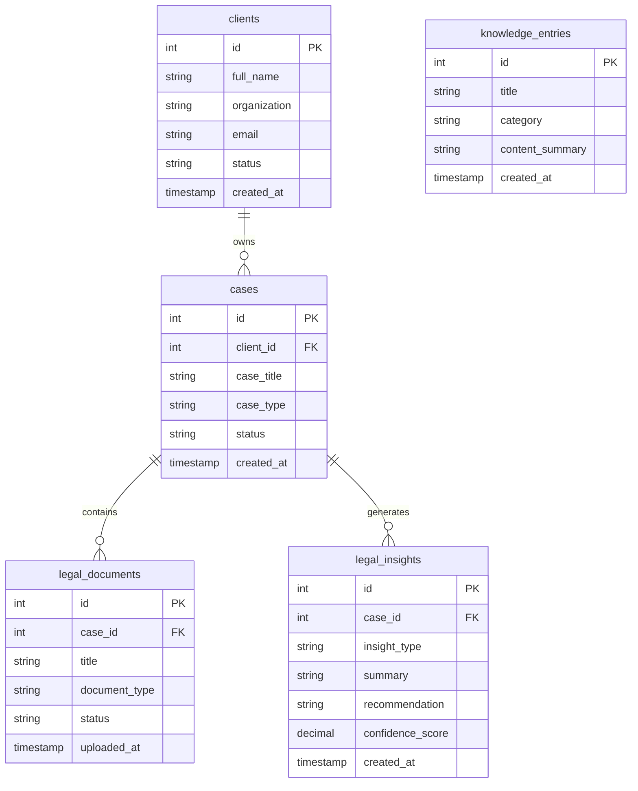

# Entity Relationship Diagram

```mermaid
erDiagram

    clients {
        int id PK
        string full_name
        string organization
        string email
        string status
        timestamp created_at
    }

    cases {
        int id PK
        int client_id FK
        string case_title
        string case_type
        string status
        timestamp created_at
    }

    legal_documents {
        int id PK
        int case_id FK
        string title
        string document_type
        string status
        timestamp uploaded_at
    }

    knowledge_entries {
        int id PK
        string title
        string category
        string content_summary
        timestamp created_at
    }

    legal_insights {
        int id PK
        int case_id FK
        string insight_type
        string summary
        string recommendation
        decimal confidence_score
        timestamp created_at
    }

    clients ||--o{ cases : owns
    cases ||--o{ legal_documents : contains
    cases ||--o{ legal_insights : generates
```
